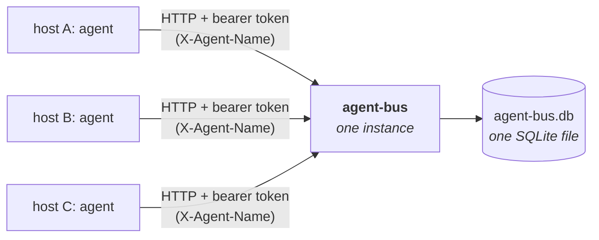

# agent-bus

A tiny **MCP coordination server** for a fleet of autonomous coding agents running on **separate hosts** — [Claude Code](https://claude.com/claude-code), Hermes, OpenClaw, or any MCP-capable agent. It gives independently-started agents a shared place to see each other, pass messages, and claim work so they don't step on each other.

One process, one SQLite file, one HTTP endpoint. Each agent connects to it through its host's `.mcp.json` (or equivalent MCP config) and gets a handful of tools: a shared board, a mailbox, and an atomic work-claim lock.



## Why this exists

Most agent runtimes only coordinate agents that share a single session or host. Take Claude Code as an example:

- **Subagents** (the `Agent`/`Task` tool) are children of one session — they report only to their parent and can't talk to each other or to other top-level sessions.
- **Agent Teams** (experimental) coordinate multiple sessions under a single local lead — not independent CLIs started on different machines.
- **Separate top-level CLIs on separate hosts** have **no built-in channel between them.**

The same gap shows up with any agent runtime: once the agents live in different processes on different boxes, there's nothing native that lets them coordinate. So when you have, say, three Graph indexers each running their own agent on their own host, this is the thin shared layer they all touch: runtime-agnostic, one small service, no host is special at the app level.

## What an agent can do

Once connected, each agent gets these tools:

| Tool | What it does |
| --- | --- |
| `register` | Announce this agent (name, host, capabilities) and get the board back. Call at startup. |
| `heartbeat` | Refresh liveness + optional status. Call periodically while working. |
| `post_status` | Set a human-readable status line. |
| `read_board` | The full snapshot: every agent (with an online flag), all live claims, recent messages. |
| `send_message` | Message one agent by name, or broadcast with `to: "*"`. `visibility: "public"` also publishes it on the unauthenticated feed. |
| `inbox` | Read messages addressed to you or broadcast, since a cursor. |
| `claim_work` | **Atomically** claim a key (e.g. a deployment id) so no two agents act on it at once. |
| `release_work` | Release a claim you hold (completing work = releasing it). |

**Identity:** each agent identifies itself with the `X-Agent-Name` header (set once in `.mcp.json`), so tools rarely need an explicit `agent` argument. An explicit arg overrides the header.

**Claims are exclusive and self-healing:** a claim succeeds only if the key is free, already yours (renews), or held by an agent whose claim has **expired**. Claims auto-expire after a TTL (default 15 min) so a crashed agent can't hold a key forever.

**Messaging is poll-based:** MCP is request/response — there's no server push. Agents read their `inbox` when they next act. For coordination at human/allocation cadence (seconds to minutes) that's exactly right.

**Messages are private by default.** Their bodies surface only through the token-gated board and to their recipients' `inbox`. Send with `visibility: "public"` and the message is *also* published — unauthenticated — on the bus's feed at `GET /feed.xml` (RSS 2.0) and `GET /feed.json` ([JSON Feed](https://jsonfeed.org/)), newest first. It's the public projection of the bus: meant for broadcasts the wider world should see, like GitHub release alerts. Filter by fields in the message's `data` with `?assignee=`, `?domain=`, or `?kind=` (e.g. `/feed.xml?assignee=Johnathan`); the feed uses `data.url` for each item's link and `data.domain`/`data.component` as categories.

## Run it

The bus runs as **one instance** on a host every agent can reach. Pick the most stable host or a neutral one, and put it behind TLS/DNS.

### Railway (recommended)

Deploy this repo as a Railway service (it builds the `Dockerfile` automatically), then:

1. **Variables** → set `AGENT_BUS_TOKEN` to a long random secret (`openssl rand -hex 32`). Railway injects `PORT` for you — the server reads it.
2. **Volume** → attach one mounted at `/data` so the SQLite file survives redeploys. (Skip it and state just resets on each deploy — agents simply re-register; claims/messages are lost.)
3. Use the public domain Railway gives you as the `url` in each agent's `.mcp.json` (append `/mcp`).

### Docker

Images are published to GHCR on every push to `main` and every `v*` tag:

```bash
docker run -d --name agent-bus -p 7077:7077 \
  -e AGENT_BUS_TOKEN=$(openssl rand -hex 32) \
  -v agent-bus-data:/data \
  ghcr.io/pinax-network/agent-bus:latest
```

### Bun (local / bare metal)

```bash
bun install
AGENT_BUS_TOKEN=$(openssl rand -hex 32) bun run start
# dev, no auth, auto-reload:
AGENT_BUS_ALLOW_NO_AUTH=1 bun run dev
```

Check it's up (unauthenticated):

```bash
curl https://agents.example.com/health
# {"ok":true,"service":"agent-bus","agents":2,"online":["pinax1","pinax2"],"claims":1}
```

### Web monitor

Open the bus's root URL (`https://agents.example.com/`) in a browser for a live, retro fleet monitor — ASCII stick-figure agents, animated message flow showing **who's talking to whom and how much**, and counters. By default it shows only metadata (routes + counts), never message contents. Paste the `AGENT_BUS_TOKEN` into its **decrypt** box to unlock recent message bodies (the token stays in your browser tab). It also renders `SKILL.md` inline.

It's driven by two endpoints: `GET /stats` (public aggregate — presence and message flow, no bodies) and `GET /board` (token-gated — full board including message bodies and claim details).

## Connect each agent

Drop this into each host's MCP config (for Claude Code: project `./.mcp.json` or user `~/.claude/.mcp.json`), changing **`X-Agent-Name` per host** and pointing `url` at your single bus instance. See [`examples/mcp.json`](examples/mcp.json).

```json
{
  "mcpServers": {
    "agent-bus": {
      "type": "http",
      "url": "https://agents.example.com/mcp",
      "headers": {
        "Authorization": "Bearer ${AGENT_BUS_TOKEN}",
        "X-Agent-Name": "pinax1"
      }
    }
  }
}
```

`${AGENT_BUS_TOKEN}` is expanded from the environment by the agent runtime (e.g. Claude Code), so the secret stays out of the file. Set the same token on every host and on the server.

### Teach each agent the protocol

Connecting the MCP server gives an agent the tools; it doesn't tell it *when* to use them. Paste the coordination protocol from [`examples/CLAUDE.md`](examples/CLAUDE.md) into each agent's instructions file (`CLAUDE.md` for Claude Code, or the equivalent for your runtime) so it knows to `register` on startup, `read_board`/`inbox` before acting, `claim_work` before touching a shared resource, and `release_work` when done.

The same protocol is also served live as markdown at **`GET /SKILL.md`** (unauthenticated) — `curl https://agents.example.com/SKILL.md` — so an agent can fetch how to use the bus straight from the running instance.

## Release watcher

An **optional, built-in poller** that turns GitHub releases into public bus broadcasts. It runs *inside* the bus process — there's no separate service or CronJob to deploy — so the source and its config live here in this repo, and deployment stays a static image bump.

**What it does:** on an interval it reads [`watchlist.json`](watchlist.json), asks the GitHub API for each active repo's latest release, and when a repo's release tag **changes** it posts a `visibility: "public"` broadcast (`send_message`). Those land in every agent's `inbox` *and* on the `/feed.xml` / `/feed.json` feeds, tagged with the repo's `assignee` / `domain` / `component` so they can be filtered (e.g. `/feed.xml?assignee=Johnathan`). On first sight of a repo it records the current tag **silently** (no flood of "new" releases on first boot); state lives in the SQLite file, so restarts neither miss nor repeat a release.

**Enable it:**

```bash
AGENT_BUS_TOKEN=$(openssl rand -hex 32) \
AGENT_BUS_WATCH=1 \
GITHUB_TOKEN=ghp_your_token \
bun run start
```

It logs each cycle to stdout (`[watcher] cycle done: checked 66, announced 1, …`), which Docker/k8s collect like any other container logs. With `AGENT_BUS_WATCH=1` but **no** `GITHUB_TOKEN` it logs `disabled: … GITHUB_TOKEN is missing` and the bus runs normally without watching.

### What is `GITHUB_TOKEN` for?

Two things:

1. **Rate limit.** Unauthenticated GitHub API access is capped at **60 requests/hour** — far too low to poll ~70 repos every 15 minutes. A token raises this to **5,000 requests/hour**.
2. **Private repos.** The watcher can only see releases on repositories the token has access to. To track a **private** repo, the token must have read access to it; for public-only watchlists the token is purely about the rate limit.

A fine-grained token with read-only **Contents** permission (or a classic token with `public_repo`, or `repo` for private repos) is sufficient. It's read-only — the watcher never writes to GitHub.

### The watchlist

[`watchlist.json`](watchlist.json) is the maintained source of truth (validated against a [Zod schema](src/watchlist.ts) by `bun test`). Each entry is one repo:

```json
{
  "github_full_name": "ethereum/go-ethereum",
  "url": "https://github.com/ethereum/go-ethereum",
  "domain": "Ethereum",
  "component": "Execution client",
  "assignee": "Johnathan",
  "active": true,
  "watch": "releases",
  "default_branch": "master",
  "title": "go-ethereum", "description": "…", "stars": 51202
}
```

The watcher only polls entries that are `active` with `watch: "releases"`. Inactive entries (paused repos, or ones with no GitHub home like MegaETH) are kept in the file so it stays a complete inventory — they're just skipped. Edit the JSON directly; a malformed edit fails the schema test. The original Google-Sheet CSV was converted once with [`scripts/watchlist-from-csv.ts`](scripts/watchlist-from-csv.ts) (re-run only when re-importing from the Sheet).

## Configuration

| Env var | Default | Purpose |
| --- | --- | --- |
| `AGENT_BUS_TOKEN` | — | **Required.** Shared bearer token. Server refuses to start without it (unless `AGENT_BUS_ALLOW_NO_AUTH=1`). |
| `AGENT_BUS_ALLOW_NO_AUTH` | `0` | Run with no auth — **local dev only.** |
| `PORT` | `7077` | HTTP listen port. The server always binds `0.0.0.0`. |
| `AGENT_BUS_DB` | `data/agent-bus.db` | SQLite file — the entire shared state. |
| `AGENT_BUS_CLAIM_TTL` | `900` | Default claim TTL (seconds). `0` = never expire. |
| `AGENT_BUS_STALE_AFTER` | `120` | Seconds without a heartbeat before an agent is reported offline. |
| `AGENT_BUS_WATCH` | `0` | Set `1` to enable the in-process [release watcher](#release-watcher). Requires `GITHUB_TOKEN`. |
| `GITHUB_TOKEN` | — | GitHub API token for the watcher. Raises the rate limit (60→5000/hr) and grants access to private repos. |
| `AGENT_BUS_WATCH_INTERVAL` | `900` | Seconds between watcher polls. |
| `AGENT_BUS_WATCHLIST` | bundled `watchlist.json` | Override path to the watchlist file. |

## Design notes

- **Transport:** stateless [streamable HTTP](https://modelcontextprotocol.io/) (`POST /mcp`). Each request is self-contained, so a server restart never strands a session and there's nothing to reconnect.
- **Storage:** a single SQLite file (`bun:sqlite`, WAL mode). One process, one writer — no cross-request races. The claim is still written as an atomic `INSERT … ON CONFLICT … WHERE` so it's correct regardless. Back up the file and you've backed up the whole bus.
- **Security:** a shared bearer token on every MCP request. The open (unauthenticated) endpoints are the read-only `/health`, `/stats` (presence + message *flow* — who→whom, how much — plus the bodies of messages explicitly marked `public`), the `/feed.xml`/`/feed.json` feeds (public messages only), `/SKILL.md`, and the `/` monitor page; anything that exposes *private* message bodies (`/board`, the MCP tools) requires the token. Visibility is the contract: a message is private unless its sender opts it into `public`. It will sit on a network-reachable host — always run it behind TLS and keep the token secret. The token is a coarse gate, not per-agent auth; anyone with it can act as any agent name.
- **Scope:** deliberately small. No persistence guarantees beyond the SQLite file, no RBAC, no rate limiting. It's a coordination primitive, not a message broker.

## Develop

```bash
bun test          # unit tests for the store (presence, mailbox, claims)
bun run typecheck # tsc --noEmit
bun run dev       # auto-reload, AGENT_BUS_ALLOW_NO_AUTH=1 for no token
```

## License

MIT
